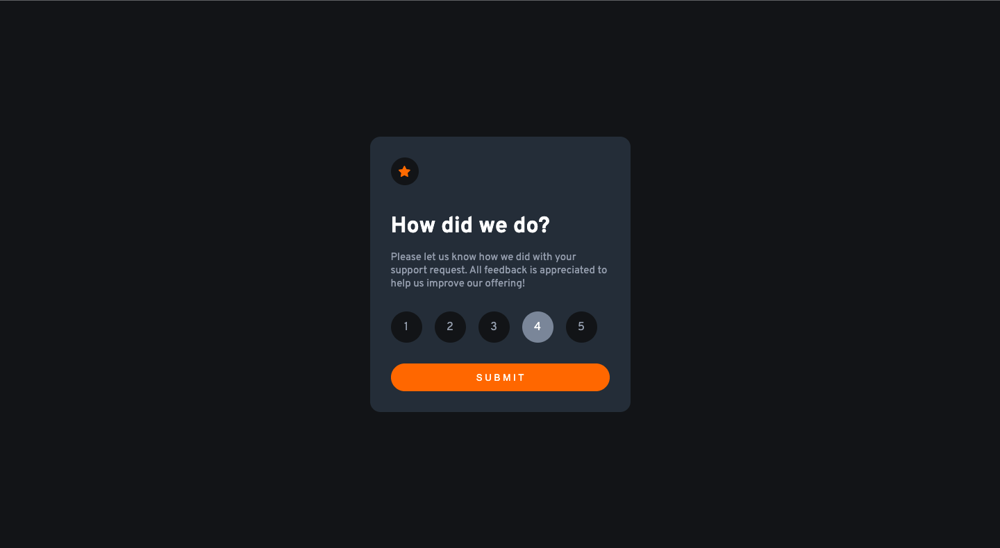
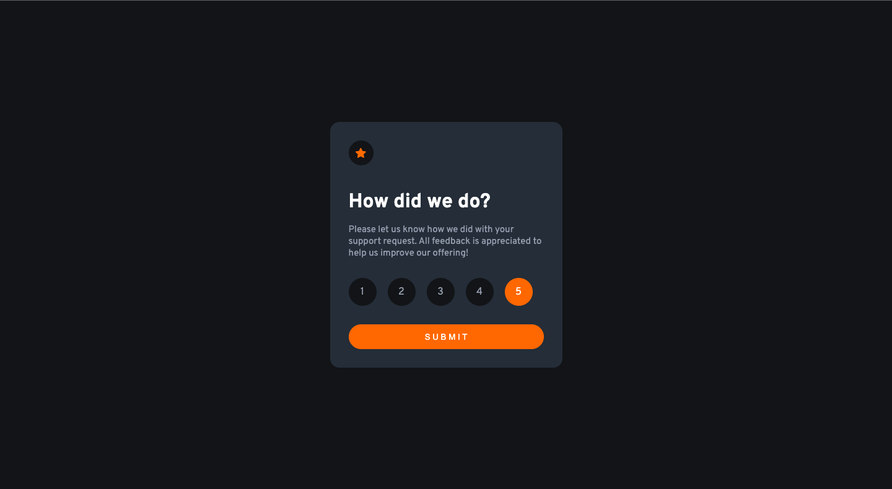
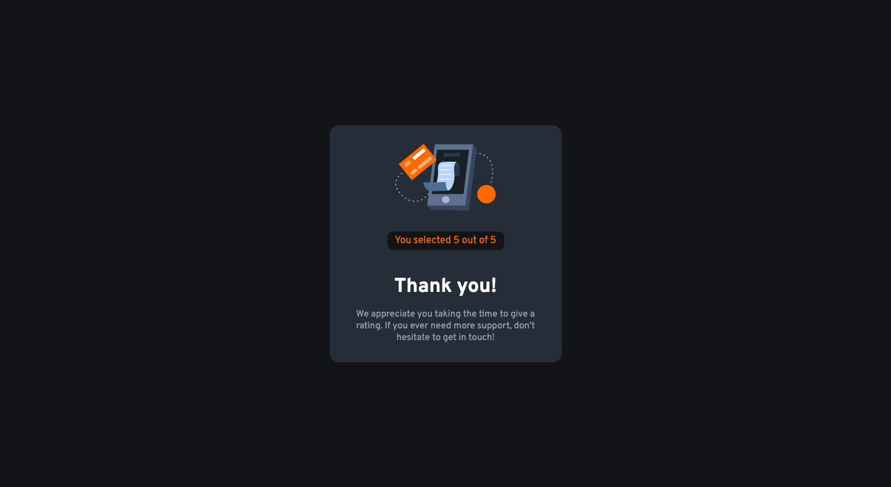
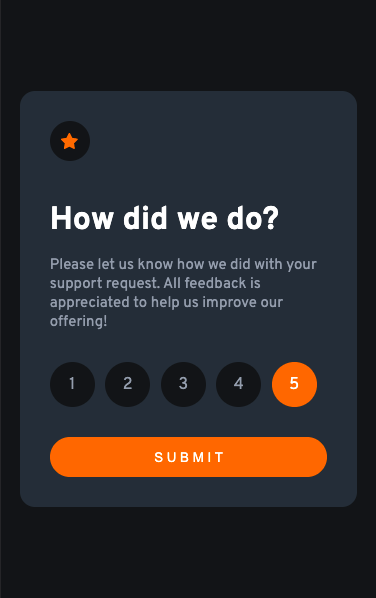

# Frontend Mentor - Interactive rating component solution

This is a solution to the [Interactive rating component challenge on Frontend Mentor](https://www.frontendmentor.io/challenges/interactive-rating-component-koxpeBUmI). Frontend Mentor challenges help you improve your coding skills by building realistic projects.

## Table of contents

- [Overview](#overview)
  - [The challenge](#the-challenge)
  - [Screenshot](#screenshot)
- [My process](#my-process)
  - [Built with](#built-with)
  - [What I learned](#what-i-learned)
- [Author](#author)

## Overview

### The challenge

Users should be able to:

- View the optimal layout for the app depending on their device's screen size
- See hover states for all interactive elements on the page
- Select and submit a number rating
- See the "Thank you" card state after submitting a rating

### Screenshot

#### Active state




#### Thank you state



#### Mobile preview



#### Mobile thank you state


## My process

### Built with

- Semantic HTML5 markup
- CSS custom properties
- CSS Grid
- Mobile-first workflow
- JavaScript
- Media queries

### What I learned

To set width for mobile devices i've learned media queries 

```html
<div class="rating_cart">
   Content here
</div>
```

```css
@media screen and (max-width:1440px) {
   .rating_cart{
      width: 375px;
   }
}

@media screen and (max-width:375px) {
   .rating_cart{
      width: 90%;
   }
}
```

## Author

- Frontend Mentor - [@marshalles](https://www.frontendmentor.io/profile/marshalles)

